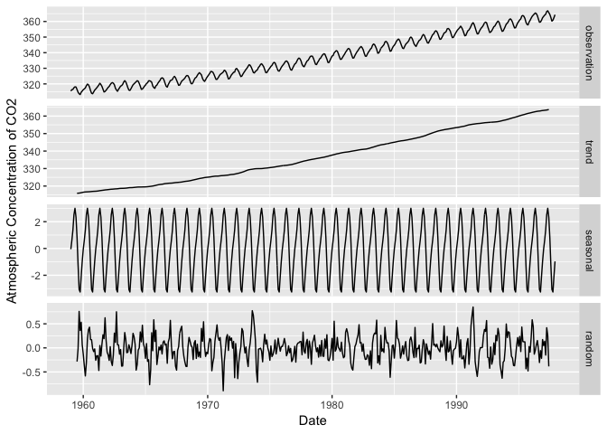
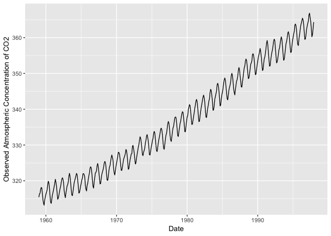
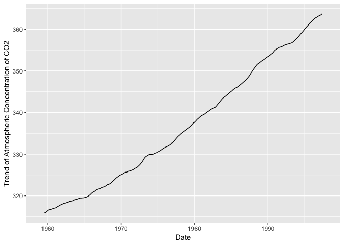
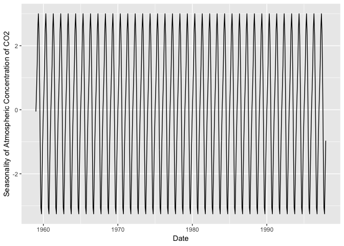
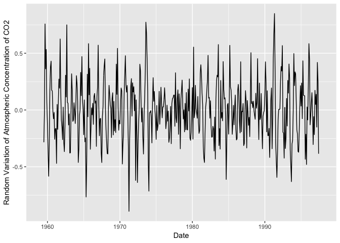
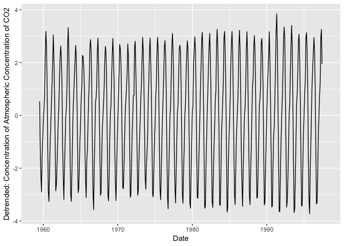
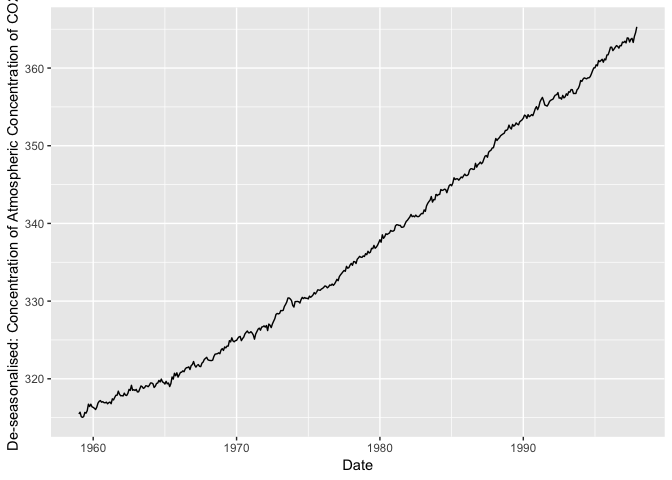

ggplottimeseries: Visualisation of decomposed time series with ggplot2
================

Introduction
------------

This package contains functions that allow users to plot decomposed time series data with ggplot2.

Installation
------------

To install this package, you can use the following codes:

``` r
devtools:: install_github("brisneve/ggplottimeseries")
library(ggplottimeseries)
```

Functions
---------

**Decompose time series data into its components (i.e. trends, seasonal, random) and collate them into a data frame.**

To demonstrate this, we will use the function *dts1* to decompose the daily sea surface temperature data into its three components. This dataset has 2142 observations on the following 2 variables:

1.  date - a vector of time of observation (class: data, format: YYYY-MM-DD)
2.  sst - sea surfae temperature data (class: numeric)

The *dts1* function requires the following inputs:

1.  x - dates of the observations
2.  y - observations
3.  z - frequency of the obserbation over a period of time (e.g. year)
4.  type - type of timeseries (additive or multiplicative)

Try the codes below and explore the output data frame which contains the components of the time series:

``` r
data(sst)

x <- sst$date
y <- sst$sst
z <- 365.25 #number of days in a year

df <- dts1(x,y,z, type = "additive")

head(df)
```

    ##         date observation trend  seasonal random
    ## 1 2013-03-12     20.8159    NA -6.423352     NA
    ## 2 2013-03-13     20.9987    NA -6.429219     NA
    ## 3 2013-03-14     21.1530    NA -6.586590     NA
    ## 4 2013-03-15     21.7346    NA -6.570229     NA
    ## 5 2013-03-16     22.1610    NA -6.406814     NA
    ## 6 2013-03-17     22.6093    NA -6.560656     NA

Alternatively, if you have a time series-class data you can use the function *dts2*. See how this function works using the co2 dataset that contains a time series of atmospheric concentration of CO2. This function creates a dataframe of the time series components similar to that of *dts1*.

``` r
data(co2)

df <- dts2(co2, type ="additive")

head(df)
```

    ##                  date observation trend    seasonal random
    ## 1 1959-01-01 00:00:00      315.42    NA -0.05359649     NA
    ## 2 1959-01-31 10:00:01      316.31    NA  0.61055921     NA
    ## 3 1959-03-02 20:00:01      316.50    NA  1.37564693     NA
    ## 4 1959-04-02 06:00:01      317.56    NA  2.51682018     NA
    ## 5 1959-05-02 16:00:01      318.13    NA  3.00028509     NA
    ## 6 1959-06-02 02:00:01      318.00    NA  2.32921053     NA

We now have a data frame that we could plot using ggplot. This package offers suite of functions to plot the decomposed time series data in ggplot and can be integrated with ggplot functions. We will use the co2 dataset to illustrate these functions.

**Visualise the observed, trend, seasonal, and random components of time series into one figure**

``` r
library(ggplot2)
library(tidyr)


#plots decomposed time series into one figure
ggdecompose(df)+
  xlab("Date")+
  ylab("Atmospheric Concentration of CO2")
```



**Visualise components of time series into separate figures**

``` r
#plots the observations 
ggobserve(df)+
  xlab("Date")+
  ylab("Observed Atmospheric Concentration of CO2")
```



``` r
#plots the trend 
ggtrend(df)+
  xlab("Date")+
  ylab("Trend of Atmospheric Concentration of CO2")
```



``` r
#plots the seasonality 
ggseason(df)+
  xlab("Date")+
  ylab("Seasonality of Atmospheric Concentration of CO2")
```



``` r
#plots the random variation 
ggrandom(df)+
  xlab("Date")+
  ylab("Random Variation of Atmospheric Concentration of CO2")
```



**Detrend and de-seasonalise timeseries and visualise the data**

``` r
ggdetrend(df)+
  xlab("Date")+
  ylab("Detrended: Concentration of Atmospheric Concentration of CO2")
```



``` r
ggseason(df)+
  xlab("Date")+
  ylab("De-seasonalised: Concentration of Atmospheric Concentration of CO2")
```



**If you find this very useful, please cite this package:**

*Brisneve Edullantes (2019). ggplottimeseries: Visualisation of Decomposed Time Series with ggplot2. R package version 0.1.0.*
